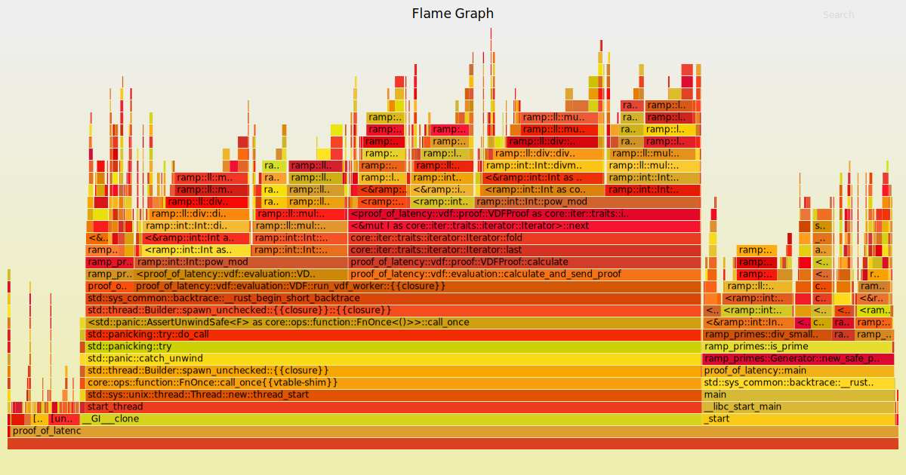

# Proof of Latency
A protocol that creates a publicly verifiable proof of latency between two peers by using two VDFs.

[Theory](https://github.com/JaniAnttonen/gradu)

## Flamegraph
**With 150k iterations:**



## Prerequisites
Currently requires Linux to run with GNU Multiple Precision Library.

To install it on Debian/Ubuntu:
```bash
sudo apt-get install -y libgmp-dev
```

...or on Red Hat based distros, such as Arch, Fedora, CentOS:
```bash
sudo dnf -y install gmp-devel
```

...and you should be good to go!

# Tested working toolchains
nightly-2020-06-23
Will break like a __ when cargo update is ran. Don't do it. Or do it for shiz and gigles
